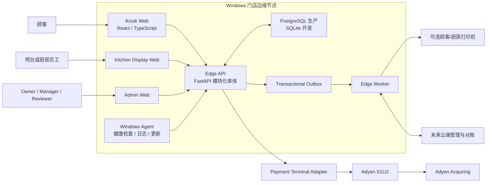
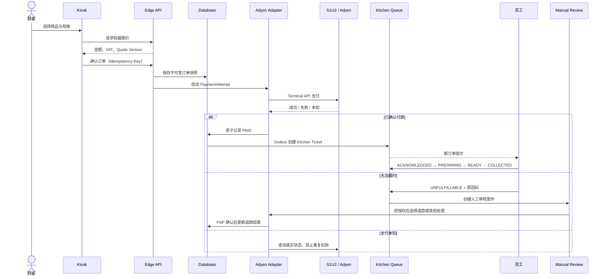
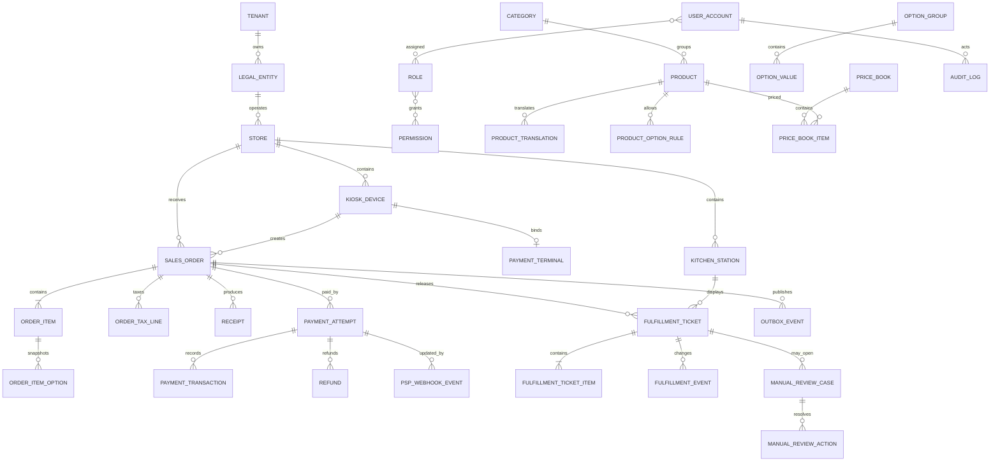

# 荷兰饮品店自助点餐与收款平台——商业级架构设计 v1.1

> 状态：已确认，第二阶段工程骨架依据
> 更新日期：2026-08-11
> 首发市场：荷兰
> 首发系统：Windows
> 核心边界：顾客点餐、支付、生成订单、人工制作与人工异常审核；**不控制自动饮品机**。

## 1. 已确认的产品范围

这是一套类似 McDonald's / KFC 自助点餐机的门店系统，而不是饮品机器人控制平台。

系统负责：

- 顾客在触摸屏浏览商品、选择规格、确认价格并付款。
- 付款成功后生成不可丢失的订单和取餐号。
- Kitchen Display System（KDS）把已付款订单交给吧台/厨房员工。
- 员工人工更新 `已接单 → 制作中 → 可取餐 → 已取餐`。
- 无法履约时创建人工审核案件，由有权限人员决定退款、部分退款、重做、替代品或其他处理。
- 管理后台负责商品、订单、员工、审核、报表和支付对账。

系统明确不负责：

- 饮品机、泵、阀、PLC、机器人或配方程序控制。
- Serial、MQTT、Modbus 或机器 HTTP 协议。
- 自动出杯、机器命令幂等或硬件模拟器。
- 付款后自动退款；履约异常必须进入人工审核。

支付读卡终端和可选顾客/厨房打印机属于点餐收款外设，可以通过独立适配器接入；它们不改变“员工人工制作、系统不控制饮品制作设备”的边界。

## 2. 核心架构决策

| 决策         | 结论                                                        |
| ------------ | ----------------------------------------------------------- |
| 首发国家     | 荷兰，默认 `NL / EUR / nl-NL / Europe/Amsterdam`            |
| 首发操作系统 | Windows；原生运行必须可用，商用机不依赖 Docker Desktop      |
| 支付方案     | 首选 Adyen + S1U2 + Terminal API 本地通信                   |
| 支付备用     | Stripe Terminal Server-driven；生产前需确认无人值守场景许可 |
| 业务架构     | FastAPI 模块化单体，暂不拆微服务                            |
| 前端应用     | Kiosk、Kitchen Display、Admin 三个独立 React 应用           |
| 数据库       | 开发可用 SQLite；商业生产目标 PostgreSQL                    |
| 履约方式     | 员工人工制作，KDS 工单驱动                                  |
| 异常策略     | 创建 Manual Review Case，不自动退款                         |
| 云端位置     | 云端不进入本地“支付成功 → 生成厨房单”的强依赖路径           |
| 顾客身份     | 默认匿名 Guest Checkout                                     |
| 现金         | 首版不支持                                                  |

## 3. 系统上下文

关键原则：

- 云后台故障时，本地商品缓存、支付和厨房队列仍应运行。
- 支付成功与 Kitchen Ticket 创建必须可靠衔接。
- KDS 暂时离线时，系统按配置暂停收款或降级到厨房打印机；不能静默漏单。
- Kiosk、KDS、Admin 是不同应用和权限边界。
- 前端不决定最终价格、VAT、支付成功或退款成功。

## 4. Backend 模块边界

| 模块                | 职责                                                |
| ------------------- | --------------------------------------------------- |
| Identity            | 管理员、员工、角色、权限、会话和未来 MFA            |
| Organization        | Tenant、Legal Entity、Store、Kiosk、Kitchen Station |
| Catalog             | 分类、商品、多语言、图片、可售状态                  |
| Pricing & Tax       | 规格加价、优惠、荷兰 VAT 规则、舍入、权威报价       |
| Ordering            | 购物车确认、订单号、不可变订单快照                  |
| Payments            | PaymentAttempt、Adyen 适配器、退款、Webhook、对账   |
| Kitchen Fulfillment | Kitchen Ticket、员工确认、制作、Ready、Collected    |
| Manual Review       | 无法履约、责任人、处理动作和审核 SLA                |
| Receipts            | 顾客小票、退款凭证、厨房打印降级、取餐号            |
| Audit               | 改价、退款、权限、审核和订单状态变更的不可变审计    |
| Reporting           | 销售、退款、履约时长、队列和 Excel 导出             |
| Sync                | 未来云边同步、Outbox/Inbox 和 Last Known Good 配置  |

首版采用模块化单体，因为订单、支付、厨房单和审核需要清晰事务边界，而当前规模不值得承担微服务的部署和故障复杂度。

## 5. 支付架构

### 5.1 首选：Adyen S1U2

首个商业版本选择 Adyen 的理由：

- S1U2 是面向无人值守场景的终端，比把普通柜台读卡器固定在机柜上更合适。
- Terminal API 与 Windows 技术栈解耦，可由本地 Payment Adapter 通信。
- 荷兰本地收单、设备运营和后续多门店能力较成熟。
- 可以把卡数据留在认证终端和 PSP 边界内。

工程只保存：

- Adyen `POIID`/终端引用。
- PSP Reference。
- PaymentAttempt、金额、币种和状态。
- 必要的卡品牌与掩码信息。

工程不保存：完整 PAN、磁道数据、CVV 或 PIN。PIN 只能由认证终端采集。

正式签约前仍需 Adyen 确认 2026 年荷兰供货、商户审核、终端固定方式和无人值守许可：

- [Adyen S1U2](https://docs.adyen.com/point-of-sale/terminals/s1u2/)
- [Adyen Terminal API](https://docs.adyen.com/point-of-sale/design-your-integration/terminal-api/)

### 5.2 支付状态

- `UNPAID`
- `INITIATED`
- `AUTHORIZING`
- `PAID`
- `FAILED`
- `UNKNOWN`
- `REFUND_PENDING`
- `PARTIALLY_REFUNDED`
- `REFUNDED`

超时不是失败。进入 `UNKNOWN` 后必须查询 PSP 或等待已验签 Webhook，禁止让顾客盲目再付一次。

## 6. 订单与人工履约状态

订单、支付、厨房履约和人工审核分别建模。

### 6.1 Order lifecycle

- `DRAFT`
- `CONFIRMED`
- `CLOSED`
- `CANCELLED`

### 6.2 Kitchen fulfillment

- `NOT_RELEASED`
- `QUEUED`
- `ACKNOWLEDGED`
- `PREPARING`
- `READY`
- `COLLECTED`
- `ON_HOLD`
- `UNFULFILLABLE`
- `CANCELLED`

### 6.3 Manual review case

状态：

- `OPEN`
- `ASSIGNED`
- `ACTION_PENDING`
- `RESOLVED`
- `CLOSED`

处理结果：

- `FULL_REFUND`
- `PARTIAL_REFUND`
- `REMAKE`
- `SUBSTITUTION`
- `MANUALLY_FULFILLED`
- `NO_FINANCIAL_ACTION`

常见原因：

- `OUT_OF_STOCK`
- `STAFF_CAPACITY`
- `MANUAL_WORKSTATION_EQUIPMENT_FAILURE`
- `ORDER_ERROR`
- `ALLERGEN_OR_RECIPE_ISSUE`
- `STORE_CLOSING`
- `OTHER`

员工不能直接删除异常订单。重做应产生新的 Kitchen Ticket，并关联原工单和 Review Case。

## 7. 交易主流程

业务约束：

1. 付款前检查门店正在接单、KDS/打印降级可用、商品可售和队列未超限。
2. 金额统一使用欧分整数，禁止浮点数。
3. 付款成功、订单状态、Kitchen Ticket 与 Outbox 在可靠事务边界内写入。
4. 已付款但未生成 Kitchen Ticket 是最高优先级告警。
5. KDS 状态操作记录员工、终端、时间和前后状态。
6. 人工审核决定退款；退款状态只以 PSP 确认为准。

## 8. Offline 与故障策略

| 故障                        | 默认行为                                       |
| --------------------------- | ---------------------------------------------- |
| 云后台不可用                | 本地继续营业，恢复后同步                       |
| 完全断网                    | 默认暂停银行卡支付，除非收单方书面批准离线交易 |
| Adyen/终端不可用            | 停止新付款，不使用 Mock 兜底                   |
| 支付响应超时                | 标记 `UNKNOWN`，查询和对账                     |
| KDS 离线但厨房打印机可用    | 按配置降级打印并产生告警                       |
| KDS 与打印机都不可用        | 暂停新付款，避免已付款漏单                     |
| Kitchen Ticket 长时间未确认 | 告警、暂停接单或人工升级                       |
| 员工标记无法履约            | 创建 Manual Review，不自动退款                 |
| 数据库/磁盘异常             | 停止新交易，优先保护已付款记录                 |
| 配置发布失败                | 使用 Last Known Good 版本                      |

## 9. 数据模型核心

关键快照字段：

- `order_item.name_snapshot`
- `order_item.unit_price_minor`
- `order_item.tax_snapshot`
- `order_item.preparation_snapshot`
- `order_item.allergen_snapshot`
- `order_item_option.name_snapshot`
- `order_item_option.price_delta_minor`

Kitchen Ticket 至少保存：

- `order_id`
- `station_id`
- `display_number`
- `status`
- `priority`
- `preparation_snapshot`
- `acknowledged_by / acknowledged_at`
- `started_at / ready_at / collected_at`
- `failure_reason_code`

## 10. 荷兰与安全基线

- 默认国家 `NL`、币种 `EUR`、Locale `nl-NL`、时区 `Europe/Amsterdam`。
- 所有时间入库存 UTC，展示时正确处理荷兰夏令时。
- VAT 分类、税率和生效时间版本化，不在骨架中硬编码具体税率。
- 首版不假设存在外部财政设备；票据、账务留存和退款要求由荷兰会计师及 Belastingdienst 资料最终确认。
- 顾客默认匿名，不强制手机号、邮箱或会员账号。
- Kiosk、日志和数据库不得接触卡号、CVV 或 PIN。
- 管理员和退款审核使用 RBAC；退款发起、批准和结果必须审计。
- Windows 使用最小权限账户、Edge Kiosk 模式或 WebView2 Host、全盘加密、防火墙和受控更新。
- Kiosk 公共界面与 Admin/KDS 网络及路由隔离。

## 11. Windows 运行模型

- Kiosk：Microsoft Edge Kiosk 模式或后续最小 WebView2 Host。
- Edge API、Worker、Windows Agent：最终以 Windows Service 方式运行。
- PostgreSQL：商业生产作为本机受管服务；开发可以使用 SQLite 或可选 Docker PostgreSQL。
- Docker Desktop：只作为开发便利选项，不是商业运行依赖。
- Windows Agent：负责开机自启、进程看护、日志、版本、更新和防火墙检查。
- 本地数据库、日志和配置不得放在 SMB/云同步目录。

## 12. 工程阶段

1. **架构设计**：已完成并按人工履约修订。
2. **创建项目**：工程骨架、健康端点、占位应用、质量工具、CI 和文档；不写业务功能。
3. **Backend**：商品、计价、订单、支付状态机、KDS 工单、人工审核、审计和对账。
4. **Frontend**：Kiosk、KDS、Admin 完整业务流。
5. **UI 优化**：15/21 英寸真机、触控、无障碍、多语言和异常恢复。
6. **Adyen 实验室与商户接入**。
7. **Windows 安装、服务化、Kiosk 锁定和现场试点**。
8. **云端多门店、运营、报表和 OTA**。

## 13. 第二阶段禁止实现的内容

- 商品、购物车、订单和 VAT 业务逻辑。
- 真实或完整 Mock 支付流程。
- Webhook、退款和对账业务。
- JWT/RBAC 业务登录。
- KDS 业务状态机和人工审核功能。
- 自动饮品机、Serial、MQTT、Modbus 或硬件模拟器。
- Windows 安装包和生产服务注册。

第二阶段只建立能启动、能检查、能测试、边界正确的工程基础。
